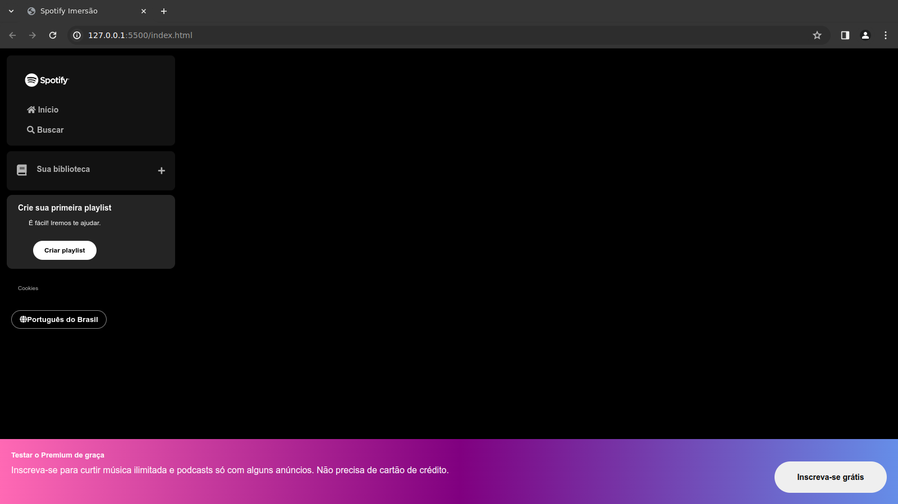

# Spotify Imersão - Front-End Alura - Dia 01

Este é o repositório da segunda aula da Imersão Front-End da Alura, onde estamos construindo um Clone do Spotify. Nesta aula, continuamos a trabalhar na navegação lateral do site.
- Desafio da Aula: fazer o footer.

## Conteúdo da Aula

- Ainda na configuração inicial do HTML e CSS
- Criação da estrutura básica da barra lateral
- Estilização da logo e dos itens de navegação
- Adição de ícones usando a biblioteca Font Awesome
- Estilização da seção "Sua biblioteca" e "Crie sua primeira playlist"
- Adição de links para "Cookies" e "Alterar idioma"

## Como utilizar o projeto

1. Clone este repositório em sua máquina local
2. Abra o arquivo `index.html` em seu navegador
3. Explore a navegação lateral do Spotify Clone

## Recursos utilizados

- HTML
- CSS
- Font Awesome (biblioteca de ícones)

## Próximos passos

Na próxima aula, continuaremos a desenvolver o Spotify Clone, adicionando mais estilos e funcionalidades à página.

## Links úteis

- [Documentação do HTML](https://developer.mozilla.org/pt-BR/docs/Web/HTML)
- [Documentação do CSS](https://developer.mozilla.org/pt-BR/docs/Web/CSS)
- [Font Awesome](https://fontawesome.com/)

## Contribuindo

Contribuições são sempre bem-vindas! Se você encontrar algum problema no projeto ou tiver sugestões de melhorias, sinta-se à vontade para abrir uma issue ou enviar um pull request.

## Instrutores

- Mayara Cardoso
- Fernanda Degolin
- Guilherle Lima

## Agradecimentos

Gostaria de agradecer a todos os participantes da Imersão Front-End da Alura por tornarem esse evento possível.

## Licença

Este projeto está licenciado sob a licença MIT. Consulte o arquivo LICENSE para obter mais informações.
