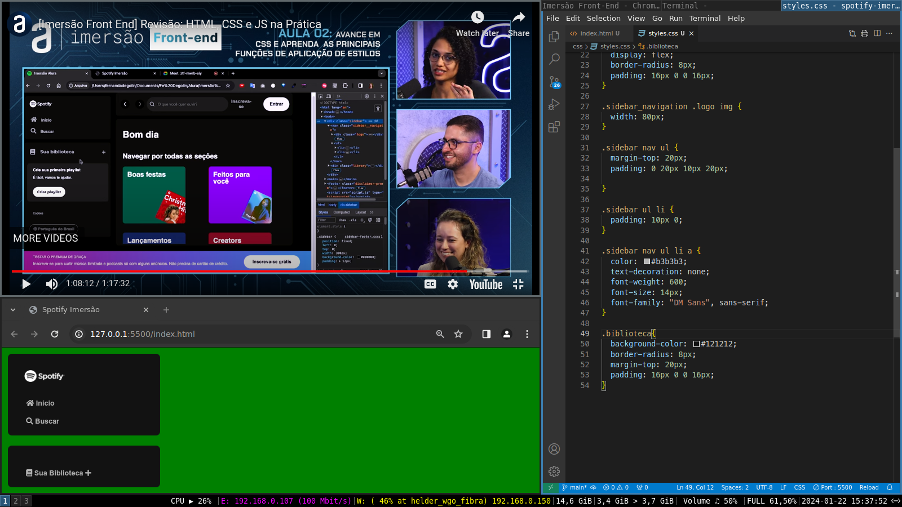

# Spotify Imersão - Front-End Alura

Este repositório contém os arquivos iniciais para um projeto de front-end que visa replicar a aparência da página inicial do Spotify. Abaixo, são comentadas as principais tags presentes nos arquivos `index.html` e `styles.css`.

{:width="800px"}

## Arquivo index.html

```html
<!DOCTYPE html>
<html lang="pt-BR">
<head>
  <!-- Definição do conjunto de caracteres e configurações iniciais -->
  <meta charset="UTF-8">
  <meta name="viewport" content="width=device-width, initial-scale=1.0">

  <!-- Título da Página -->
  <title>Spotify Imersão</title>

  <!-- Reset CSS para normalização de estilos entre navegadores -->
  <link rel="stylesheet" href="css/reset.css">
  
  <!-- Estilos Personalizados -->
  <link rel="stylesheet" href="css/styles.css">

  <!-- Font Awesome Icons para ícones de fontes -->
  <link rel="stylesheet" href="https://cdn.jsdelivr.net/npm/@fortawesome/fontawesome-free@5.15.3/css/all.min.css">
</head>
<body>
  <!-- Barra Lateral -->
  <div class="sidebar">
    <nav class="sidebar_navigation">
      
      <!-- Logo Spotify -->
      <div class="logo">
        <a href="">
          
        </a>
      </div>

      <!-- Navegação Inicial e de Busca -->
      <div class="inicio-e-busca">
        <ul>
          <li>
            <a href="">
              <span class="fa fa-home"></span>
              <span>Início</span>
            </a>
          </li>
          <li>
              <a href="">
                <span class="fa fa-search"></span>
                <span>Buscar</span>
              </a>
          </li>
        </ul>
      </div>
    </nav>

    <!-- Biblioteca -->
    <div class="biblioteca">
      <nav>
        <ul>
          <li>
            <a href="">
              <span class="fa fa-book"></span>
              <span>Sua Biblioteca</span>
              <span class="fa fa-plus"></span>
            </a>
          </li>
        </ul>
      </nav>
    </div>
  </div>
</body>
</html>
```

### Comentários sobre as principais tags:

- **`<meta charset="UTF-8">`:** Define a codificação de caracteres como UTF-8 para garantir o correto processamento de caracteres especiais.

- **`<meta name="viewport" content="width=device-width, initial-scale=1.0">`:** Configura a escala inicial e a largura da tela para dispositivos móveis, proporcionando uma experiência responsiva.

- **`<title>Spotify Imersão</title>`:** Define o título da página exibido na barra de título do navegador.

- **`<link rel="stylesheet" href="css/reset.css">` e `<link rel="stylesheet" href="css/styles.css">`:** Importa os arquivos de estilo (reset e personalizado) para aplicar estilos à página.

- **`<link rel="stylesheet" href="https://cdn...fontawesome.../all.min.css">`:** Importa a biblioteca Font Awesome para incluir ícones de fontes no projeto.

- **`<link rel="stylesheet" href="https://cdn...solid.js.../solid.css">`:** Importa estilos do Solid.js, um framework de JavaScript (ainda não utilizado no projeto fornecido).

- **`<div class="sidebar">`:** Define uma barra lateral para navegação.

- **`<a href="">`:** As âncoras vazias indicam que os links ainda não foram configurados.

- **``:** Insere a imagem do logo do Spotify.

## Arquivo styles.css

```css
/* Estilos Globais */
body {
  background-color: green;
}

/* Estilos da Barra Lateral */
.sidebar {
  position: fixed;
  top: 0;
  left: 0;
  bottom: 0;
  padding: 12px;
  width: 300px;
}

/* Estilos da Navegação na Barra Lateral */
.sidebar_navigation {
  background-color: #121212;
  border-radius: 8px;
  padding: 16px 0 0 16px;
}

.sidebar_navigation .logo {
  background: #121212;
  display: flex;
  border-radius: 8px;
  padding: 16px 0 0 16px;
}

.sidebar_navigation .logo img {
  width: 80px;
}

.sidebar nav ul {
  margin-top: 20px;
  padding: 0 20px 10px 20px;
}

.sidebar ul li {
  padding: 10px 0;
}

.sidebar nav ul li a {
  color: #b3b3b3;
  text-decoration: none;
  font-weight: 600;
  font-size: 14px;
  font-family: "DM Sans", sans-serif;
}

/* Estilos da Biblioteca */
.biblioteca {
  background-color: #121212;
  border-radius: 8px;
  margin-top: 20px;
  padding: 16px 0 0 16px;
}
```

### Comentários sobre os estilos:

- **`body {...}`:** Aplica um estilo de fundo verde ao corpo da página.

- **`.sidebar {...}`:** Define estilos para a barra lateral, como posição fixa, largura, e preenchimento.

- **`.sidebar_navigation {...}`:** Adiciona estilos à navegação da barra lateral, como cor de fundo e borda arredondada.

- **`.sidebar_navigation .logo {...}` e `.sidebar_navigation .logo img {...}`:** Estilos específicos para a área do logo, incluindo largura máxima.

- **`.sidebar nav ul {...}` e `.sidebar ul li {...}`:** Define estilos para a lista de navegação na barra lateral.

- **`.sidebar nav ul li a {...}`:** Adiciona estilos aos links na barra lateral, incluindo cor, tamanho da fonte e família de fontes.

- **`.biblioteca {...}`:** Aplica estilos específicos para a seção da biblioteca, como cor de fundo e margens.

Lembre-se de que este é um esboço inicial do projeto e pode ser expandido à medida que o desenvolvimento progride.